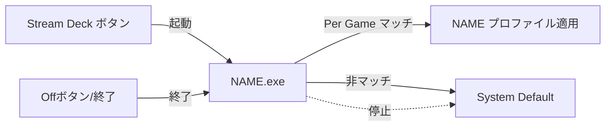
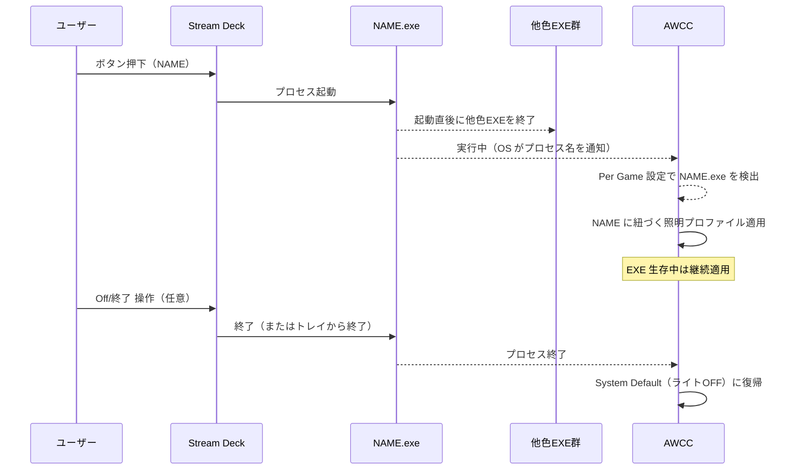
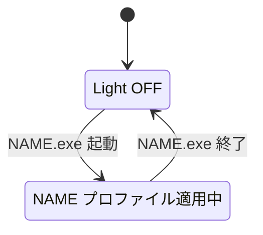

# awcc-ctrl-exe-moc

[](https://www.rust-lang.org/)
[](https://doc.rust-lang.org/rustc/platform-support.html)
[](https://www.msys2.org/)
[](LICENSE)

AlienwareのゲーミングPCにおいて、Alienware Command Center（AWCC） を直接起動して手動で色を設定せずとも、外部アプリケーション（例: Stream Deck）から Alienware のゲーミングPCのライト色を制御できるようにします。

AWCCの「Per Game（アプリごとに照明プロファイル適用）」を“逆利用”して、外部からRGBを切り替えるための最小構成のWindows常駐トレイアプリと、名前別EXEをまとめて生成する仕組みを提供します。

このプロジェクトを利用して生成された EXE を手動で AWCC（Per Game）に登録し、各 EXE に対応する色（照明プロファイル）を割り当てることで、外部からの色切り替えが成立します。2026年1月現在における現行の AWCC には公開 API が存在しないため、外部から直接プロファイルを切り替えることはできません。その制約を回避するために、Per Game の「アプリごとにプロファイルを適用する」仕組みを逆利用しています。

このアプリはAWCCのプロファイルやLEDを直接制御しません。特定のEXEが起動していることをAWCCに認識させ、そのEXEに紐づけた照明プロファイルをAWCC側で適用させます。

---

## 背景

- 近年のAWCCは「グローバルプロファイル一覧→手動切替UI」が実質消えつつあり、外部からの切替が難しい。
- 公開APIがない。
- OpenRGB は「Dell G Series D Controller」が見えてもLED定義が0で制御できないケースがある。
- 一方で AWCC の Per Game 自動切替は残っている。

本プロジェクトでは Per Game を“逆利用”して、外部からの切替（状態指定）を実現します。

---

## 完成形アーキテクチャ

```text
AWCC
 ├ System Default → ライトOFF（デフォルト状態）
 ├ NAME1.exe      → NAME1 に紐づく照明プロファイル
 ├ NAME2.exe      → NAME2 に紐づく照明プロファイル
 └ ...            → 追加分

Stream Deck
 ├ ボタン: NAME1 → NAME1.exe を起動
 ├ ボタン: NAME2 → NAME2.exe を起動
 └ ボタン: Off   → これら常駐EXEを終了（System Defaultに戻す）
```

ポイント:

- EXE名のセットは `configure.yaml` で管理し、そこに列挙した名前のEXEを生成。
- EXEの中身は同一でOK（ファイル名のみ異なる）。
- 色（照明プロファイル）の違いは AWCC 側で EXE ごとに設定。

---

## 要件（Functional）

### 1) 生成物（EXE）

各 `NAME.exe` は次を満たす:

- Windows専用（GUIサブシステム、コンソールウィンドウ非表示）
- 起動したら常駐（メッセージループ）
- タスクトレイにアイコンを表示
- 右クリックメニューに「Exit」だけを表示し、それで終了可能
- マウスオーバー時にツールチップで「awcc-ctrl-exe-moc - 色」を表示
- 起動直後に family.txt に基づき同系統 EXE を自動停止（シングルトン）

### 2) 生成機構

- `configure.yaml` を読み、指定された名前のEXEをまとめて生成できる
- 設定ファイルを変えれば後からEXEを追加可能
- 生成方式は問わない（ベースEXEをビルドしてコピー＆リネームでも可）

---

## 設定ファイル仕様（configure.yaml）

- 形式: YAML / 文字コード: UTF-8
- `profiles` に並べた順でEXEを生成
- `name` はEXE名（拡張子なし）。Windowsファイル名として安全な文字のみ許可（推奨: `^[A-Za-z0-9_-]+$`）

最小構成例:

```yaml
version: 1
profiles:
  - name: streaming
  - name: dark
  - name: meeting
```

任意項目（あれば便利）:

```yaml
version: 1
output_dir: dist
off_name: off
profiles:
  - name: streaming
  - name: dark
```

- `output_dir` 未指定時は `dist` をデフォルトにします
- `off_name` を指定すると、同名の EXE（例: `off.exe`）を生成します。この EXE は起動直後に同系統 EXE を停止し、自身も終了します（System Default=OFF に復帰）。

---

## 非目標（Non-goals）

- AWCC のリバース/非公開プロトコル解析はしない
- USB HID を直接叩かない
- OpenRGB 連携はしない
- AWCC の現在状態取得やトグルはしない（状態指定型で運用）

---

## 開発環境（Visual Studio不要）

PowerShell中心。winget活用。GNUツールチェーン（MSYS2 UCRT）でのビルドを前提。

- Rust: rustup
- Toolchain: `stable-x86_64-pc-windows-gnu`
- MinGW: MSYS2（UCRT64）

winget 例:

```powershell
winget install --id Rustlang.Rustup -e
winget install --id MSYS2.MSYS2 -e
```

MSYS2 UCRT64 で:

```bash
pacman -Syu
pacman -S --needed base-devel mingw-w64-ucrt-x86_64-toolchain
```

PowerShell の PATH に追加:

```text
C:\msys64\ucrt64\bin
```

---

## セットアップ（ゼロから）

Windows が素の状態（何も入っていない前提）からの構築手順です。

1. winget を有効化（未導入の場合）

    - Microsoft Store で「App Installer」をインストール/更新
    - 新しい PowerShell を開き直して `winget --version` を確認

1. Git / GitHub CLI（任意）をインストール

    ```powershell
    winget install --id Git.Git -e
    winget install --id GitHub.cli -e
    ```

1. Rustup をインストール

    ```powershell
    winget install --id Rustlang.Rustup -e
    ```

1. MSYS2 をインストール

    ```powershell
    winget install --id MSYS2.MSYS2 -e
    ```

1. MSYS2 UCRT64 で MinGW ツールチェーンを導入

    - スタートメニューから「MSYS2 UCRT64」を起動

    ```bash
    pacman -Syu
    pacman -S --needed base-devel mingw-w64-ucrt-x86_64-toolchain
    ```

1. PATH に UCRT64 の bin を追加（恒久設定を推奨）

    推奨はいずれも「ユーザー環境変数 Path」を安全に編集する方法です。`setx` は 1024 文字制限で既存の Path が切り捨てられる恐れがあるため推奨しません。

    - GUI（推奨・安全）
      - `Win + R` → `sysdm.cpl` → 詳細設定 → 環境変数
      - ユーザーの「Path」を選択 → 編集 → 新規 で `C:\msys64\ucrt64\bin` を追加
      - 可能なら上位に移動 → OK で保存 → 新しい PowerShell を開き直す

    - PowerShell（.NET API を使用）

      ```powershell
      $ucrt = 'C:\msys64\ucrt64\bin'
      $user = [Environment]::GetEnvironmentVariable('Path','User')
      if ($user -notlike "*$ucrt*") {
        [Environment]::SetEnvironmentVariable('Path', ($user + ';' + $ucrt), 'User')
      }
      ```

      反映のため PowerShell を開き直します。

    - 反映までの一時回避（セッション限定）

      ```powershell
      $env:Path = "C:\msys64\ucrt64\bin;" + $env:Path
      ```

1. Rust の GNU ツールチェーンを既定に設定

    ```powershell
    rustup toolchain install stable-x86_64-pc-windows-gnu
    rustup default stable-x86_64-pc-windows-gnu
    ```

1. リポジトリの取得（未取得の場合）

    ```powershell
    git clone https://github.com/<owner>/<repo>.git
    cd <repo>
    ```

1. 動作確認

    ```powershell
    rustc -Vv        # host: x86_64-pc-windows-gnu が期待値
    Get-Command gcc  # C:\\msys64\\ucrt64\\bin\\gcc.exe を解決（PowerShell）
    where.exe gcc    # cmd の where を明示
    ```

    補足: PowerShell では `where` は `Where-Object` の別名です。コマンド検索には `Get-Command` か `where.exe` を使ってください。

1. ビルド

    ```powershell
    cargo build --release
    ```

トラブルシューティング:

- PATH が反映されない / `gcc` が見えない
  - PowerShell で `Get-Command gcc` または `where.exe gcc` を使用（`where` は NG）
  - `C:\msys64\ucrt64\bin` がユーザー Path に追加されているか確認（`sysdm.cpl`→環境変数）
  - セッション限定での確認: `$Env:Path = 'C:\msys64\ucrt64\bin;' + $Env:Path`
- `setx` で PATH を伸ばしたら壊れた
  - `setx` は 1024 文字制限で Path が切り捨てられる恐れあり。GUI か .NET API で恒久設定を編集
  - ユーザー Path に不正な要素（例: `C:\Program Files\P`）や重複があれば削除
- MSYS2 のツールチェーンが見つからない
  - MSYS2 UCRT64 を起動し、`pacman -S --needed mingw-w64-ucrt-x86_64-toolchain` を実行
- SmartScreen が出る
  - 「詳細情報」→「実行」（自己ビルドのバイナリのため）

---

## 実装方針（Rust）

最小の Win32 メッセージループ＋トレイアイコン。

- `windows` crate で Win32 API（`CreateWindowExW` / `RegisterClassW` / `GetMessageW` 等）
- トレイ: `Shell_NotifyIconW` を直接使用（または最小ラッパを利用）
- 必須挙動:
  - 隠しウィンドウを作る（メッセージ受信のため）
  - トレイアイコンを追加
  - 右クリックでコンテキストメニューを出し、「Exit」クリックで終了
  - 終了時にトレイアイコン削除

---

## ビルドと生成

```powershell
# 依存の取得・ビルド（workspace 全体）
cargo build --release

# 生成コマンド
# configure.yaml を元に dist/ 以下へ NAME.exe を生成（runner を毎回ビルドしてから複製）
cargo run --release -p generator -- -c configure.yaml

# 高速化したい場合はビルドをスキップ（runner を事前にビルドしている前提）
cargo run --release -p generator -- -c configure.yaml --no-build
```

- 生成物の出力先は既定で `dist/` を想定
- generator 実行時、以前の構成で生成されていた EXE のうち、現在の `configure.yaml` に存在しないものは自動で削除します（`dist/family.txt` と `dist/off.txt` に基づくクリーンアップ）。

トレイ動作（現在のUX）:

- マウスオーバー時にツールチップで 「awcc-ctrl-exe-moc - EXE 名」（例: `awcc-ctrl-exe-moc - red`）を表示
- 右クリックメニューの先頭に同じ文字列（例: `awcc-ctrl-exe-moc - red`）を表示（クリック不可）
- 2行目にセパレータ、3行目に `Exit` を表示（クリックで終了）

---

## 運用（AWCC / Stream Deck）

AWCC 側:

- System Default: ライトOFF に設定
- `dist/NAME.exe` を各名前ごとに Per Game の対象として追加し、照明プロファイルを割り当て

Stream Deck 側:

- 「NAME」ボタン: `dist/NAME.exe` を起動（他色EXEは起動直後に本アプリ側で自動停止）
- 「Off」ボタン: `dist/off.exe` を起動（同系統EXEを停止し System Default に復帰）

シングルトン（同系統 EXE の自動停止）:

- generator は `dist/family.txt` に同系統の EXE 名一覧（`*.exe`）を書き出します。
- runner は起動直後にこのファイルを読み、自分以外の EXE 名に一致するプロセスを終了します。

---

## 受け入れ条件（Acceptance Criteria）

- `configure.yaml` に指定した名前のEXEが `dist/` に生成される
- `NAME.exe` 起動 → AWCCが `NAME.exe` に紐づく照明に切り替わる
- トレイの右クリックメニューから「Exit」で終了できる
- `NAME.exe` 終了 → System Default（OFF）に戻る
- `configure.yaml` に名前を追加すれば、同様にEXEが追加生成できる（拡張容易）

---

## 使い方の流れ（Mermaid 図）

概要フロー（flowchart）:



シーケンス図（sequenceDiagram）:



状態遷移図（stateDiagram）:



---

## Stream Deck 応用例（本体色のワンボタン切替）

目的: Stream Deck から任意の色（= AWCC プロファイル）に即時切替し、Off で System Default に戻す。

セットアップ:

- `configure.yaml` に色名を追加し、EXE を生成（例: `streaming.exe`, `dark.exe`, `meeting.exe`）
- AWCC の Per Game で各 EXE に照明プロファイルを割り当て

ボタン例（推奨パターン）:

- シングルトン対応により、各色ボタンは単純に `dist/NAME.exe` を起動するだけで他色が自動停止し、対象色のみが残ります

応用メモ:

- 既定を OFF 運用にしたい場合、Off ボタンは `dist/off.exe` を起動
- EXE 名を増やしたら、本アプリの生成時にファミリーとして内包されるため、起動直後の自動停止対象に含まれます

---

## 使用例: 色に合わせた EXE でライト切替

色ごとに EXE を用意し、AWCC の Per Game で色プロファイルを割り当て、Stream Deck から起動して本体ライトを切り替える例です。

1. `configure.yaml` に色名を列挙（例）:

    ```yaml
    version: 1
    profiles:
      - name: red
      - name: blue
      - name: green
      - name: warm_white
    ```

1. 生成後、`dist/` に以下が並ぶ想定:

    - `red.exe`, `blue.exe`, `green.exe`, `warm_white.exe`

1. AWCC で設定:

    - Per Game に上記 EXE をそれぞれ追加
    - `red.exe` → 真っ赤の照明プリセット、`blue.exe` → 青、`green.exe` → 緑、`warm_white.exe` → 暖色白 …のように割り当て

1. Stream Deck のボタン割り当て:

    - 「Red」: `dist/red.exe` を起動
    - 「Blue」: `dist/blue.exe` を起動
    - 「Green」: `dist/green.exe` を起動
    - 「Warm」: `dist/warm_white.exe` を起動
    - 「Off」: `dist/off.exe` を起動

ポイント:

- 各 EXE の中身は同一で、ファイル名のみが AWCC のマッチキーになります
- 複数色 EXE を同時起動しても AWCC の動作は環境依存になるため、常に一つだけ動かす運用を推奨します
- 既定（何も起動していない状態）は System Default（ライトOFF）にしておくと分かりやすいです

---

## ライセンス

- MIT License（`LICENSE` を参照）

---

## ステータス / ロードマップ

完了（現在）:

- セットアップ手順（MSYS2 UCRT64 + GNU toolchain）
- ワークスペース構成（`crates/runner`, `crates/generator`）
- runner:
  - トレイ常駐、右クリックメニュー（先頭に「awcc-ctrl-exe-moc - 色」（クリック不可）／下段に `Exit`）
  - マウスオーバーでツールチップ表示（「awcc-ctrl-exe-moc - 色」）
  - 起動直後に family.txt に基づき同系統 EXE を自動停止（シングルトン）
  - `off.exe` は同系統停止後、自身も即終了（System Default に復帰）
- generator:
  - `configure.yaml` から `dist/<name>.exe` を生成（毎回 runner をビルド → 複製。`--no-build` でスキップ可）
  - `off_name` 対応（`off.exe` と `off.txt`）
  - 以前の構成に存在し現構成に無い EXE を自動削除（`family.txt` / `off.txt` を参照）
- ドキュメント: README / AGENTS.md / SKILLS.md / CLAUDE.md 整備
- CI: markdownlint、Windows のビルド＋ generator ユニットテスト（`cargo test -p generator`）
- ユニットテスト（generator）: `exe_name` / `read_prev_managed` / `remove_obsolete`

次の予定:

- generator: 実行中 EXE の検出と保護（警告/スキップ or `off.exe` 自動実行→再試行）
- runner: 終了手順の丁寧化（WM_CLOSE → 待機 → Terminate）
- runner: アイコン/バージョン情報（Windows リソース）埋め込み
- ドキュメント: AWCC 設定スクリーンショット、Stream Deck テンプレの追加
